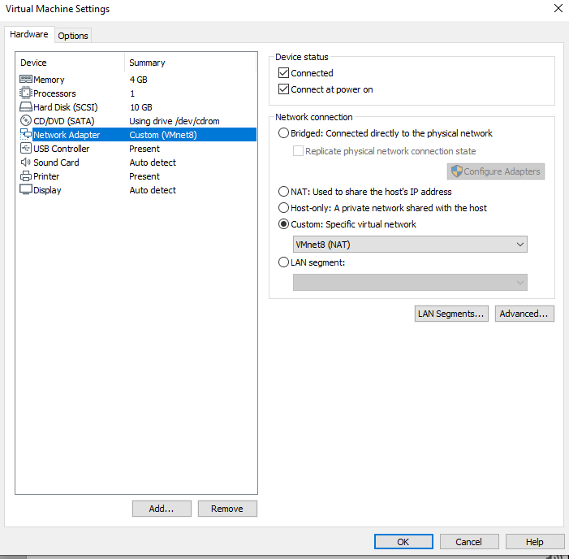
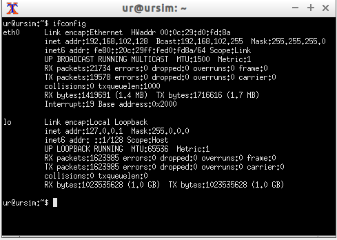
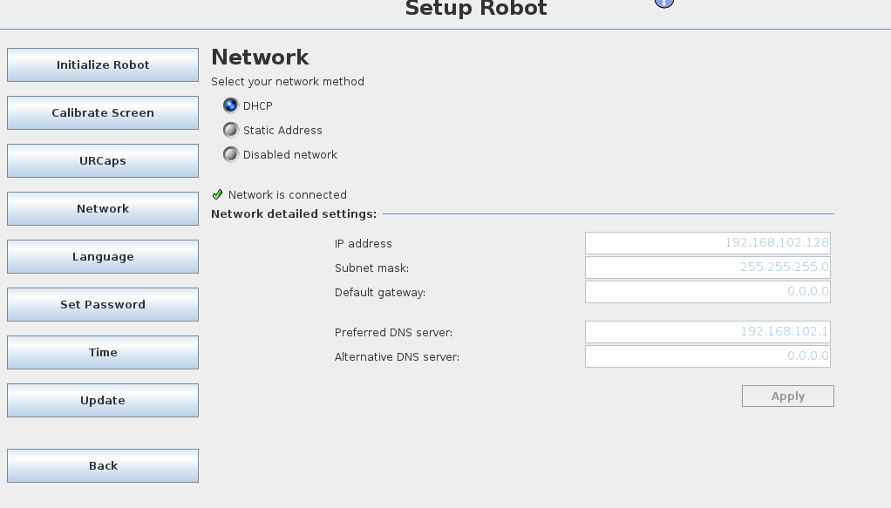
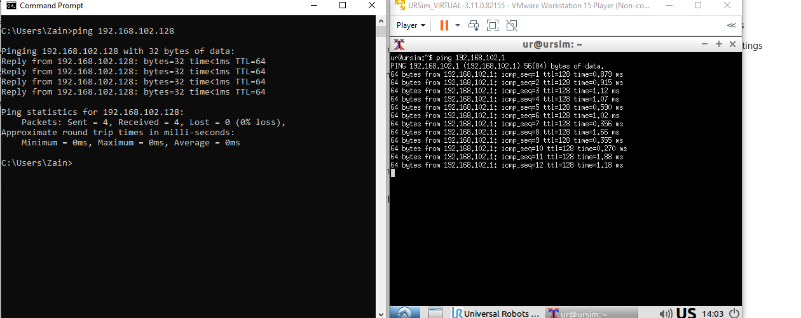

# UR-Simulation-in-Unity-Hardware-in-the-loop-Animation-of-Real-Robot-

**All the credit for original package and controller goes to [Long Qian](http://longqian.me/aboutme), [Shuyang Chen](https://www.linkedin.com/in/shuyang-shawn-chen-346ab6109) for creating the prefab and initial script.

This fork Simulates UR using joint angles being published by a real robot over TCP IP.
- Additions and Modifications are as follows:
#### - TCP server that can connect to real UR5/UR10
#### - Some modifications in the joint angle mapping to replicate actual robot. 
#### - Buttons for camera rotation.

You need to publish joint angles from UR script to this server in order to replicate motion.

Results on Editor:


## Instructions for URsim / Actual Robot
### UR Simulator
I have used URSIM version 3.11 which can be downloaded from https://www.universal-robots.com/download/?option=18940.

### VMware
Download vmware from https://www.vmware.com/products/workstation-pro/workstation-pro-evaluation.html. I think any version not so obsolete should work. Once you have installed vmware you should have two VMware Network Adapters named VMnet1 and VMnet8 in Windows network Connections.


### Setup
- First you need to configure network settings in vmware. Go to Player->Manage-> Virtual Machine Settings. In "Device" panel choose 
  "Network Adapter". In my case I choose VMnet8(NAT). 
  
  
  
- Open network adapter's properties in Windows and set static ip address as follows:
  Check ipv4 address of guest in vmware using ifconfig. 
  
  
  
  In my case it was "192.168.102.128". I set ip of VMnet8 as "192.168.102.1" with same subnet mask. This will be the IP of your server.
- Open URsim10/URsim5 and check robots network setting in "Setup Robot" -> Network. Choose DHCP. It will assign the same ip address to   
  the robot as that of guest (192.168.102.128) in my case.
  
  
  
- Disable firewall in windows otherwise guest wont be able to communicate with the host. 
- If everything goes well you should be able to ping back and forth between guest and the host.

  
  
 ### UR Script
 Here is a simple UR script that will get joint angles and publish it to our server. Make sure to adjust IP addresses and ports
 accordingly.
 
 ```
  Program
   BeforeStart
     Script: JointFunction.script
   Robot Program
     MoveJ
       Waypoint_1
       Waypoint_2
   Thread_1
     Loop sockon≟ True 
       getjointAngles()
       Wait: 0.05
     If sockon≟ False 
       socket_close("sock1")
       sockon=socket_open("192.168.102.1",5000)
       Wait: 0.01
 ```
 #### jointFunction Script
 
 ```
global angles=[0,0,0,0,0,0]
global angles_send=""

sockon=socket_open("192.168.102.1",5000,"sock1")
def getjointAngles():
  angles=get_actual_joint_positions()
  angles_send=str_cat(angles[0],";")
  angles_send=str_cat(angles_send,angles[1])
  angles_send=str_cat(angles_send,";")
  angles_send=str_cat(angles_send,angles[2])
  angles_send=str_cat(angles_send,";")
  angles_send=str_cat(angles_send,angles[3])
  angles_send=str_cat(angles_send,";")
  angles_send=str_cat(angles_send,angles[4])
  angles_send=str_cat(angles_send,";")
  angles_send=str_cat(angles_send,angles[5])
  sockon= socket_send_line(angles_send)
			
end

 ```
 
